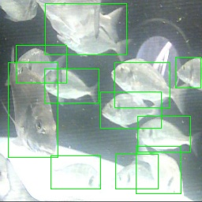

# Smart Fish Diagnosis
Monitor fish growth and health using deep learning models. 

<p align="center">

 </p>
<p align="center">

</p>


The modeling pipeline is based on object detection model trained s follows:


*  **Data preparation**: process/structure the  manually annotated raw images generated from monitoring video stream
*  **Model Training**: fine-tune the CNN model using pytorch and Tensorboard
*  **Model Deployment**: The trained model is deployed using API server 

# Instructions
**1. Setup the docker image**
```
$ bash/1-build.sh
```
**2. run Docker container**
```
bash/3-run.sh
```
Then, you can run the modeling pipeline inside the container as :

```
python src/dataset.py --cfg ./config/config.yml
python src/train.py --cfg ./config/config.yml
python src/test.py --cfg ./config/config.yml
python src/deploy.py --cfg ./config/config.yml
```

**3. show the tensorboard/hyper-parameters experiments**
```
$ tensorboard --logdir artifacts
```
# Acknowledgement

This work was inspired by different online resources. The used parts were adapted with/without modifications. The main resources are cited as follows:
*  [Compute Intersection over Union (IoU) using the predicted BBoxes](https://gist.github.com/meyerjo/dd3533edc97c81258898f60d8978eddc)
